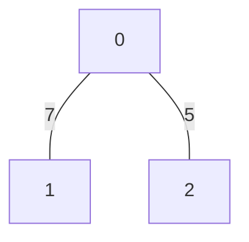
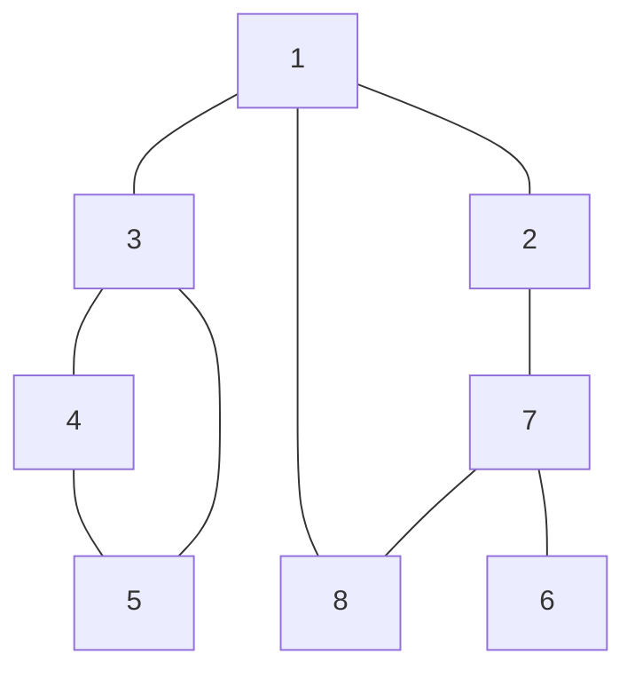

# 탐색 알고리즘

## 그래프란?

그래프는 <strong>노드(Node)</strong>와 <strong>간선(Edge)</strong>으로 표현되며, 이 때 노드를 <strong>정점(Vertex)</strong>이라고도 말한다. 또한 간선으로 연결된 두 노드는 <strong>인접(Adjacent) 노드</strong>라고 표현한다.
즉, 그래프 탐색이란 `하나의 노드를 시작으로 간선으로 연결된 다수의 노드들을 방문하는 것`을 말한다.

프로그래밍에서 그래프는 <strong>인접 행렬(Adjacency Matrix)</strong>과 <strong>인접 리스트(Adjacency List)</strong> 2가지로 표현된다.
만약 아래와 같은 그래프가 있을 때 어떻게 인접 행렬과 인접 리스트로 표현할 수 있는지 알아보자.



### 인접 행렬(Adjacency Matrix)

> 2차원 배열로 그래프의 연결 관계를 표현하는 방식

그래프의 관계를 표로 표현하면 아래와 같다.

| | **0** | **1** | **2** |
| :---: | :---: | :---: | :---: |
| **0** | 0 | 7 | 5 |
| **1** | 7 | 0 | INF |
| **2** | 5 | INF | 0 |

동일한 노드들 관계는 거리 차이가 존재하지 않기 때문에 0으로 표기한다.
반면 간선으로 연결되지 않은 노드들은 거리를 측정할 수 없기 때문에 INF(무한)으로 표기한다.

이 표는 2차원 리스트를 활용해 코드로 구현할 수 있다.

```python
INF = 999999999

graph = [
  [0, 7, 5],
  [7, 0, INF],
  [5, INF, 0]
]
```

### 인접 리스트(Adjacency List)

> 리스트로 그래프의 연결 관계를 표현하는 방식

그래프는 링크드 리스트로 아래와 같이 표현할 수 있다.

* **0** -> **1**(7) -> **2**(5)
* **1** -> **0**(7)
* **2** -> **0**(5)

그리고 다음과 같이 2차원 리스트를 활용해 코드로 표현할 수 있다.

```python
graph = [
  # 노드 0에 연결된 노드 정보(노드, 거리)
  [(1, 7), (2, 5)],

  # 노드 1에 연결된 노드 정보(노드, 거리)
  [(0, 7)],

  # 노드 2에 연결된 노드 정보(노드, 거리)
  [(0, 5)]
]
```

참고로 파이썬의 리스트는 링크드 리스트의 기능을 기본으로 제공한다.

### 인접 행렬과 인접 리스트의 차이점

인접 행렬의 경우, 모든 노드들과의 관계를 저장하므로 노드 개수가 많을수록 메모리가 낭비된다.
반면 인접 리스트의 경우, 연결된 정보만을 저장하므로 메모리 효율성이 좋다.

하지만 탐색 성능에서는 반대의 결과를 가진다.
인접 행렬의 경우 `graph[0][2]`로 즉시 찾을 수 있어 <strong>O(1)</strong> 시간 복잡도를 가진다.
반면 인접 리스트의 경우, 노드 0에 대한 인접 리스트를 앞에서부터 차례대로 확인해야 하기 때문에 <strong>O(N)</strong> 시간 복잡도를 가진다.

DFS, BFS 알고리즘에서는 각 노드마다 연결된 노드들을 방문하여 풀이를 하게 된다. 그러므로 이 알고리즘에서는 **인접 리스트**를 활용한다.

## DFS(Deep First Search, 깊이 우선 탐색)

> 그래프에서 깊은 부분을 우선적으로 탐색하는 알고리즘.

DFS는 특정한 경로로 탐색하다가 특정한 상황에서 최대한 깊숙히 들어가서 노드를 방문한 후 다시 돌아가 다른 경로로 탐색하는 알고리즘이다.
구체적인 동작 과정은 다음과 같다.

1. 탐색 시작 노드를 스택에 삽입하고 방문 처리를 한다.
2. 스택의 최상단 노드에 방문하지 않은 인접 노드가 있으면, 그 인접 노드를 스택에 넣고 방문 처리를 한다. 방문하지 않은 인접 노드가 없으면 스특에서 최상단 노드를 꺼낸다.
3. 2번의 과정을 더 이상 수행할 수 없을 때까지 반복한다.

* 방문 처리는 스택에 한 번 삽입되어 처리된 노드가 다시 삽입되지 않게 체크하는 것을 의미한다.

아래와 같은 그래프의 탐색 과정을 살펴보자.



1. 시작 노드인 `1`을 스택에 넣고 방문 처리를 한다.
2. 최상단 노드인 `1`에 인접하고 방문하지 않은 노드들 중 가장 작은 노드인 `2`를 스택에 넣고 방문 처리를 한다.
3. 최상단 노드인 `2`에 인접하고 방문하지 않은 노드인 `7`을 스택에 넣고 방문 처리를 한다.
4. 최상단 노드인 `7`에 인접하고 방문하지 않은 노드들 중 작은 노드인 `6`을 스택에 넣고 방문 처리를 한다.
5. 최상단 노드인 `6`에 방문하지 않은 인접 노드가 없으므로 `6`을 스택에서 꺼낸다.
6. 최상단 노드인 `7`에 인접하고 방문하지 않은 노드인 `8`을 스택에 넣고 방문 처리를 한다.
7. 최상단 노드인 `8`에 방문하지 않은 인접 노드가 없으므로 `8`을 스택에서 꺼낸다.
8. 최상단 노드인 `7`에 방문하지 않은 인접 노드가 없으므로 `7`을 스택에서 꺼낸다.
9. 최상단 노드인 `2`에 방문하지 않은 인접 노드가 없으므로 `2`을 스택에서 꺼낸다.
10. 최상단 노드인 `1`에 인접하고 방문하지 않은 노드인 `3`을 스택에 넣고 방문 처리를 한다.
11. 최상단 노드인 `3`에 인접하고 방문하지 않은 노드들 중 작은 노드인 `4`를 스택에 넣고 방문 처리를 한다.
12. 최상단 노드인 `4`에 인접하고 방문하지 않은 노드인 `5`를 스택에 넣고 방문 처리를 한다.
13. 최상단 노드인 `5`에 방문하지 않은 인접 노드가 없으므로 `5`를 스택에서 꺼낸다.
14. 최상단 노드인 `4`에 방문하지 않은 인접 노드가 없으므로 `4`를 스택에서 꺼낸다.
15. 최상단 노드인 `3`에 방문하지 않은 인접 노드가 없으므로 `3`을 스택에서 꺼낸다.
16. 최상단 노드인 `1`에 방문하지 않은 인접 노드가 없으므로 `1`을 스택에서 꺼낸다.
17. 더 방문할 노드가 없으므로 탐색을 종료한다.

결과적으로 `1 -> 2 -> 7 -> 6 -> 8 -> 3 -> 4 -> 5`의 순서대로 노드를 탐색했다.

위 설명에서 stack을 활용해 노드를 방문 처리하는 과정을 설명했다. 하지만 실제 코드에서는 재귀 함수를 활용해 스택의 기능을 구현한다. 이러한 이유는 함수가 내부적으로 **호출 스택(call stack)**을 활용하여 동작하기 때문이다. 그러므로 별도의 stack 자료구조를 사용하지 않아도 **재귀 함수**를 활용해 <strong>O(V + E)</strong>의 시간 복잡도를 가지는 DFS를 구현할 수 있다. 여기서 V는 노드의 개수, E는 간선의 개수를 의미한다.

```python
def dfs(graph, v, visited):
    # 현재 노드를 방문 처리
    visited[v] = True
    print(v, end=' ')

    # 현재 노드와 연결된 다른 노드를 재귀적으로 방문
    for i in graph[v]:
        if not visited[i]:
            dfs(graph, i, visited)

# 그래프 정보(인접 리스트 표현)
graph = [
    [],         # 노드 0 (사용하지 않음)
    [2, 3, 8], # 노드 1에 연결된 노드들
    [1, 7],    # 노드 2에 연결된 노드들
    [1, 4, 5], # 노드 3에 연결된 노드들
    [3, 5],    # 노드 4에 연결된 노드들
    [3, 4],    # 노드 5에 연결된 노드들
    [7],       # 노드 6에 연결된 노드들
    [2, 6, 8], # 노드 7에 연결된 노드들
    [1, 7]     # 노드 8에 연결된 노드들
]

# 각 노드가 방문된 정보를 표현하는 리스트
visited = [False] * 9

# DFS 함수 호출
dfs(graph, 1, visited)
```

## BFS(Breadth First Search, 너비 우선 탐색)

> 그래프에서 넓은 부분을 우선적으로 탐색하는 알고리즘.

이 알고리즘은 가까운 노드부터 차례대로 탐색하는 알고리즘이다.
구체적인 동작 과정은 다음과 같다.

1. 탐색 시작 노드를 큐에 삽입하고 방문 처리를 한다.
2. 큐에서 노드를 꺼내 해당 노드의 인접 노드 중 방문하지 않은 노드를 모두 큐에 삽입하고 방문 처리를 한다.
3. 2번의 과정을 더 이상 수행할 수 없을 때까지 반복한다

아래와 같은 그래프의 탐색 과정을 살펴보자.


1. 시작 노드인 `1`을 큐에 넣고 방문 처리를 한다.
2. 큐에서 `1`을 꺼내고, 인접하고 방문하지 않은 노드들인 `2`, `3`, `8`을 큐에 넣고 방문 처리를 한다.
3. 큐에서 `2`를 꺼내고, 인접하고 방문하지 않은 노드인 `7`을 큐에 넣고 방문 처리를 한다.
4. 큐에서 `3`을 꺼내고, 인접하고 방문하지 않은 노드들인 `4`, `5`를 큐에 넣고 방문 처리를 한다.
5. 큐에서 `8`을 꺼내고, 인접하고 방문하지 않은 노드가 없으므로 아무 것도 하지 않는다.
6. 큐에서 `7`을 꺼내고, 인접하고 방문하지 않은 노드인 `6`을 큐에 넣고 방문 처리를 한다.
7. 큐에서 `4`를 꺼내고, 인접하고 방문하지 않은 노드가 없으므로 아무 것도 하지 않는다.
8. 큐에서 `5`를 꺼내고, 인접하고 방문하지 않은 노드가 없으므로 아무 것도 하지 않는다.
9. 큐에서 `6`을 꺼내고, 인접하고 방문하지 않은 노드가 없으므로 아무 것도 하지 않는다.
10. 더 방문할 노드가 없으므로 탐색을 종료한다.

결과적으로 `1 -> 2 -> 3 -> 8 -> 7 -> 4 -> 5 -> 6`의 순서대로 노드를 탐색했다.
BFS는 큐(Queue) 자료구조를 활용해 구현한다. 파이썬에서는 collections 라이브러리의 deque를 활용해 큐를 구현할 수 있다. 이를 활용해 <strong>O(V + E)</strong>의 시간 복잡도를 가지는 BFS를 구현할 수 있다. 여기서 V는 노드의 개수, E는 간선의 개수를 의미한다.

* deque는 **Double - Ended Queue**의 줄임말로 <strong>O(1)</strong>의 시간 복잡도로 양방향 삽입/삭제가 모두 가능한 자료구조다.
* 파이썬의 list 또한 queue처럼 사용할 수 있는 pop 메서드를 제공한다. 하지만 동적 배열이기에 모든 요소를 한 칸씩 이동(<strong>O(N)</strong>)하는 비용이 발생하여 bfs 알고리즘에 적합하지 않다.
* queue 라이브러리는 멀티스레드 환경용이므로 단일 스레드에서는 deque가 더 적합하다.

```python
from collections import deque

def bfs(graph, start, visited):
    # 큐(Queue) 구현을 위해 deque 라이브러리 사용
    queue = deque([start])
    # 현재 노드를 방문 처리
    visited[start] = True

    while queue:
        # 큐에서 하나의 원소를 뽑아 출력
        v = queue.popleft()
        print(v, end=' ')

        # 해당 원소와 연결된, 아직 방문하지 않은 원소들을 큐에 삽입
        for i in graph[v]:
            if not visited[i]:
                queue.append(i)
                visited[i] = True

# 그래프 정보(인접 리스트 표현)
graph = [
    [],         # 노드 0 (사용하지 않음)
    [2, 3, 8], # 노드 1에 연결된 노드들
    [1, 7],    # 노드 2에 연결된 노드들
    [1, 4, 5], # 노드 3에 연결된 노드들
    [3, 5],    # 노드 4에 연결된 노드들
    [3, 4],    # 노드 5에 연결된 노드들
    [7],       # 노드 6에 연결된 노드들
    [2, 6, 8], # 노드 7에 연결된 노드들
    [1, 7]     # 노드 8에 연결된 노드들
]

# 각 노드가 방문된 정보를 표현하는 리스트
visited = [False] * 9

# BFS 함수 호출
bfs(graph, 1, visited)
```

## 정리

| | **DFS** | **BFS** |
| :---: | :---: | :---: |
| **동작 원리** | Stack | Queue |
| **구현 방법** | 재귀 함수 | Queue 자료구조 |
| **시간 복잡도** | O(N) | O(N) |

DFS와 BFS 유형의 문제는 2차원 배열에서의 탐색 문제를 다룬다. 그러므로 이러한 유형을 풀이할 때는 주어진 정보 속에서 그래프를 찾아내어 변환하는 것이 중요하다.
